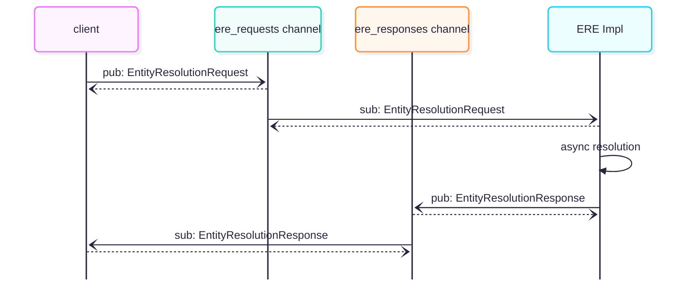

Made with [Mermaid chart](http://www.mermaidchart.com).

```mermaid
---
config:
  look: neo
  theme: redux-color
  mirrorActors: false
  sequence:
    bottomMarginAdj: 0.1
---
sequenceDiagram
  participant client
  participant ere_requests as ere_requests channel
  participant ere_responses as ere_responses channel
  participant ERE_Impl as ERE Impl

  client -) ere_requests: pub: EntityResolutionRequest
  ere_requests --) client:
  ere_requests -) ERE_Impl: sub: EntityResolutionRequest
  ERE_Impl --) ere_requests:
  ERE_Impl ->> ERE_Impl: async resolution
  ERE_Impl -) ere_responses: pub: EntityResolutionResponse
  ere_responses --) ERE_Impl:
  ere_responses -) client: sub: EntityResolutionResponse
  client --) ere_responses:
```