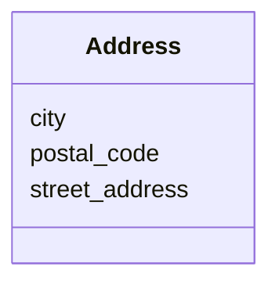

# Class: Address 


URI: [schema:PostalAddress](http://schema.org/PostalAddress)





<!-- no inheritance hierarchy -->


## Slots

| Name | Cardinality and Range | Description | Inheritance |
| ---  | --- | --- | --- |
| [street_address](street_address.md) | 0..1 <br/> [String](String.md) |  | direct |
| [city](city.md) | 0..1 <br/> [String](String.md) |  | direct |
| [postal_code](postal_code.md) | 0..1 <br/> [String](String.md) |  | direct |


## Identifier and Mapping Information


### Schema Source


* from schema: https://w3id.org/linkml/examples/personinfo


## Mappings

| Mapping Type | Mapped Value |
| ---  | ---  |
| self | schema:PostalAddress |
| native | https://w3id.org/linkml/examples/personinfo/Address |


## LinkML Source

<!-- TODO: investigate https://stackoverflow.com/questions/37606292/how-to-create-tabbed-code-blocks-in-mkdocs-or-sphinx -->

### Direct

<details>
```yaml
name: Address
from_schema: https://w3id.org/linkml/examples/personinfo
attributes:
  street_address:
    name: street_address
    from_schema: https://w3id.org/linkml/examples/personinfo
    rank: 1000
    domain_of:
    - Address
    range: string
  city:
    name: city
    from_schema: https://w3id.org/linkml/examples/personinfo
    rank: 1000
    domain_of:
    - Address
    range: string
  postal_code:
    name: postal_code
    from_schema: https://w3id.org/linkml/examples/personinfo
    rank: 1000
    domain_of:
    - Address
    range: string
class_uri: schema:PostalAddress

```
</details>

### Induced

<details>
```yaml
name: Address
from_schema: https://w3id.org/linkml/examples/personinfo
attributes:
  street_address:
    name: street_address
    from_schema: https://w3id.org/linkml/examples/personinfo
    rank: 1000
    alias: street_address
    owner: Address
    domain_of:
    - Address
    range: string
  city:
    name: city
    from_schema: https://w3id.org/linkml/examples/personinfo
    rank: 1000
    alias: city
    owner: Address
    domain_of:
    - Address
    range: string
  postal_code:
    name: postal_code
    from_schema: https://w3id.org/linkml/examples/personinfo
    rank: 1000
    alias: postal_code
    owner: Address
    domain_of:
    - Address
    range: string
class_uri: schema:PostalAddress

```
</details>