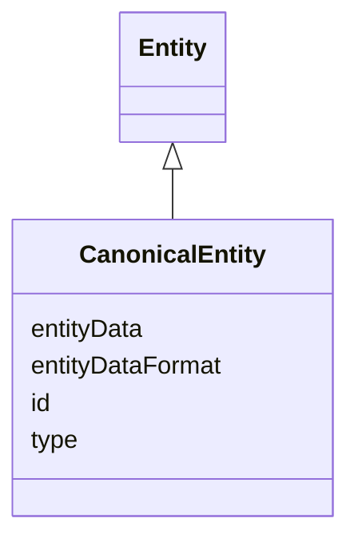

# Class: CanonicalEntity 


_A canonical entity is an entity that the ERE has created during the resolution process_

_of ERS entities._

__

_TODO: we don't support lineage for the moment, see the ERE contract document._

__


URI: [ers:CanonicalEntity](https://data.europa.eu/ers/schema/CanonicalEntity)





## Inheritance
* [Entity](Entity.md)
    * **CanonicalEntity**


## Slots

| Name | Cardinality and Range | Description | Inheritance |
| ---  | --- | --- | --- |
| [id](id.md) | 1 <br/> [Uri](Uri.md) | The (canonical) URI of the canonical entity | direct |
| [type](type.md) | 1 <br/> [String](String.md) | A string representing the entity type URI (based on CET) | [Entity](Entity.md) |
| [entityDataFormat](entityDataFormat.md) | 0..1 <br/> [String](String.md) | A string about the MIME format of `entityData` (e | [Entity](Entity.md) |
| [entityData](entityData.md) | 0..1 <br/> [String](String.md) | A code string representing the entity details (eg, RDF description) | [Entity](Entity.md) |


## Usages

| used by | used in | type | used |
| ---  | --- | --- | --- |
| [EntityResolutionResponse](EntityResolutionResponse.md) | [canonicalEntity](canonicalEntity.md) | range | [CanonicalEntity](CanonicalEntity.md) |


## Identifier and Mapping Information


### Schema Source


* from schema: https://data.europa.eu/ers/schema


## Mappings

| Mapping Type | Mapped Value |
| ---  | ---  |
| self | ers:CanonicalEntity |
| native | ers:CanonicalEntity |


## LinkML Source

<!-- TODO: investigate https://stackoverflow.com/questions/37606292/how-to-create-tabbed-code-blocks-in-mkdocs-or-sphinx -->

### Direct

<details>
```yaml
name: CanonicalEntity
description: 'A canonical entity is an entity that the ERE has created during the
  resolution process

  of ERS entities.


  TODO: we don''t support lineage for the moment, see the ERE contract document.

  '
from_schema: https://data.europa.eu/ers/schema
is_a: Entity
attributes:
  id:
    name: id
    description: 'The (canonical) URI of the canonical entity. This restricts the
      parent range to URIs only.


      Contrary to `Entity.id`, this is always known/required for canonical entities.

      '
    from_schema: https://data.europa.eu/ers/schema
    domain_of:
    - Entity
    - CanonicalEntity
    range: uri
    required: true

```
</details>

### Induced

<details>
```yaml
name: CanonicalEntity
description: 'A canonical entity is an entity that the ERE has created during the
  resolution process

  of ERS entities.


  TODO: we don''t support lineage for the moment, see the ERE contract document.

  '
from_schema: https://data.europa.eu/ers/schema
is_a: Entity
attributes:
  id:
    name: id
    description: 'The (canonical) URI of the canonical entity. This restricts the
      parent range to URIs only.


      Contrary to `Entity.id`, this is always known/required for canonical entities.

      '
    from_schema: https://data.europa.eu/ers/schema
    alias: id
    owner: CanonicalEntity
    domain_of:
    - Entity
    - CanonicalEntity
    range: uri
    required: true
  type:
    name: type
    description: "A string representing the entity type URI (based on CET).\n\nNote\
      \ that we don't use the `designates_type` thing here, since entities or canonical\
      \ entities \nare always used in clearly distinct contexts.\n"
    from_schema: https://data.europa.eu/ers/schema
    alias: type
    owner: CanonicalEntity
    domain_of:
    - RequestOrResponseMixin
    - Entity
    range: string
    required: true
  entityDataFormat:
    name: entityDataFormat
    description: 'A string about the MIME format of `entityData` (e.g. text/turtle,
      application/ld+json)

      '
    from_schema: https://data.europa.eu/ers/schema
    rank: 1000
    alias: entityDataFormat
    owner: CanonicalEntity
    domain_of:
    - Entity
    range: string
  entityData:
    name: entityData
    description: 'A code string representing the entity details (eg, RDF description).

      '
    from_schema: https://data.europa.eu/ers/schema
    rank: 1000
    alias: entityData
    owner: CanonicalEntity
    domain_of:
    - Entity
    range: string

```
</details>