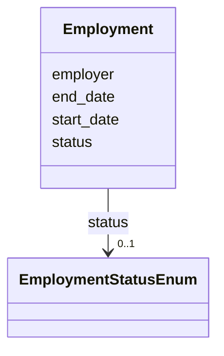

# Class: Employment 


URI: [schema:Employment](http://schema.org/Employment)





<!-- no inheritance hierarchy -->


## Slots

| Name | Cardinality and Range | Description | Inheritance |
| ---  | --- | --- | --- |
| [employer](employer.md) | 0..1 <br/> [String](String.md) |  | direct |
| [start_date](start_date.md) | 0..1 <br/> [Date](Date.md) |  | direct |
| [end_date](end_date.md) | 0..1 <br/> [Date](Date.md) |  | direct |
| [status](status.md) | 0..1 <br/> [EmploymentStatusEnum](EmploymentStatusEnum.md) |  | direct |


## Identifier and Mapping Information


### Schema Source


* from schema: https://w3id.org/linkml/examples/personinfo


## Mappings

| Mapping Type | Mapped Value |
| ---  | ---  |
| self | schema:Employment |
| native | https://w3id.org/linkml/examples/personinfo/Employment |


## LinkML Source

<!-- TODO: investigate https://stackoverflow.com/questions/37606292/how-to-create-tabbed-code-blocks-in-mkdocs-or-sphinx -->

### Direct

<details>
```yaml
name: Employment
from_schema: https://w3id.org/linkml/examples/personinfo
attributes:
  employer:
    name: employer
    from_schema: https://w3id.org/linkml/examples/personinfo
    rank: 1000
    domain_of:
    - Employment
    range: string
  start_date:
    name: start_date
    from_schema: https://w3id.org/linkml/examples/personinfo
    rank: 1000
    domain_of:
    - Employment
    range: date
  end_date:
    name: end_date
    from_schema: https://w3id.org/linkml/examples/personinfo
    rank: 1000
    domain_of:
    - Employment
    range: date
  status:
    name: status
    from_schema: https://w3id.org/linkml/examples/personinfo
    rank: 1000
    domain_of:
    - Employment
    range: EmploymentStatusEnum
class_uri: schema:Employment

```
</details>

### Induced

<details>
```yaml
name: Employment
from_schema: https://w3id.org/linkml/examples/personinfo
attributes:
  employer:
    name: employer
    from_schema: https://w3id.org/linkml/examples/personinfo
    rank: 1000
    alias: employer
    owner: Employment
    domain_of:
    - Employment
    range: string
  start_date:
    name: start_date
    from_schema: https://w3id.org/linkml/examples/personinfo
    rank: 1000
    alias: start_date
    owner: Employment
    domain_of:
    - Employment
    range: date
  end_date:
    name: end_date
    from_schema: https://w3id.org/linkml/examples/personinfo
    rank: 1000
    alias: end_date
    owner: Employment
    domain_of:
    - Employment
    range: date
  status:
    name: status
    from_schema: https://w3id.org/linkml/examples/personinfo
    rank: 1000
    alias: status
    owner: Employment
    domain_of:
    - Employment
    range: EmploymentStatusEnum
class_uri: schema:Employment

```
</details>