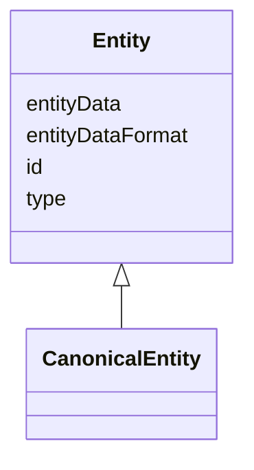

# Class: Entity 


_An entity is a representation of a real-world entity, as provided by the ERS._

_It contains the entity data (e.g. RDF description) along with metadata about_

_the entity, such as its type and the data format used to represent it._

__


URI: [ers:Entity](https://data.europa.eu/ers/schema/Entity)





## Inheritance
* **Entity**
    * [CanonicalEntity](CanonicalEntity.md)


## Slots

| Name | Cardinality and Range | Description | Inheritance |
| ---  | --- | --- | --- |
| [id](id.md) | 0..1 <br/> [String](String.md) | A string containing the entity ID or URI (set by the ERS or, for canonical en... | direct |
| [type](type.md) | 0..1 <br/> [String](String.md) | A string representing the entity type URI (based on CET) | direct |
| [entityDataFormat](entityDataFormat.md) | 0..1 <br/> [String](String.md) | A string about the MIME format of `entityData` (e | direct |
| [entityData](entityData.md) | 0..1 <br/> [String](String.md) | A code string representing the entity details (eg, RDF description) | direct |


## Identifier and Mapping Information


### Schema Source


* from schema: https://data.europa.eu/ers/schema


## Mappings

| Mapping Type | Mapped Value |
| ---  | ---  |
| self | ers:Entity |
| native | ers:Entity |


## LinkML Source

<!-- TODO: investigate https://stackoverflow.com/questions/37606292/how-to-create-tabbed-code-blocks-in-mkdocs-or-sphinx -->

### Direct

<details>
```yaml
name: Entity
description: 'An entity is a representation of a real-world entity, as provided by
  the ERS.

  It contains the entity data (e.g. RDF description) along with metadata about

  the entity, such as its type and the data format used to represent it.

  '
from_schema: https://data.europa.eu/ers/schema
attributes:
  id:
    name: id
    description: 'A string containing the entity ID or URI (set by the ERS or, for
      canonical entities, by the ERE).

      '
    from_schema: https://data.europa.eu/ers/schema
    rank: 1000
    domain_of:
    - Entity
    - CanonicalEntity
    range: string
  type:
    name: type
    description: 'A string representing the entity type URI (based on CET)

      '
    from_schema: https://data.europa.eu/ers/schema
    rank: 1000
    domain_of:
    - Entity
  entityDataFormat:
    name: entityDataFormat
    description: 'A string about the MIME format of `entityData` (e.g. text/turtle,
      application/ld+json)

      '
    from_schema: https://data.europa.eu/ers/schema
    rank: 1000
    domain_of:
    - Entity
  entityData:
    name: entityData
    description: 'A code string representing the entity details (eg, RDF description).

      '
    from_schema: https://data.europa.eu/ers/schema
    rank: 1000
    domain_of:
    - Entity

```
</details>

### Induced

<details>
```yaml
name: Entity
description: 'An entity is a representation of a real-world entity, as provided by
  the ERS.

  It contains the entity data (e.g. RDF description) along with metadata about

  the entity, such as its type and the data format used to represent it.

  '
from_schema: https://data.europa.eu/ers/schema
attributes:
  id:
    name: id
    description: 'A string containing the entity ID or URI (set by the ERS or, for
      canonical entities, by the ERE).

      '
    from_schema: https://data.europa.eu/ers/schema
    rank: 1000
    alias: id
    owner: Entity
    domain_of:
    - Entity
    - CanonicalEntity
    range: string
  type:
    name: type
    description: 'A string representing the entity type URI (based on CET)

      '
    from_schema: https://data.europa.eu/ers/schema
    rank: 1000
    alias: type
    owner: Entity
    domain_of:
    - Entity
    range: string
  entityDataFormat:
    name: entityDataFormat
    description: 'A string about the MIME format of `entityData` (e.g. text/turtle,
      application/ld+json)

      '
    from_schema: https://data.europa.eu/ers/schema
    rank: 1000
    alias: entityDataFormat
    owner: Entity
    domain_of:
    - Entity
    range: string
  entityData:
    name: entityData
    description: 'A code string representing the entity details (eg, RDF description).

      '
    from_schema: https://data.europa.eu/ers/schema
    rank: 1000
    alias: entityData
    owner: Entity
    domain_of:
    - Entity
    range: string

```
</details>