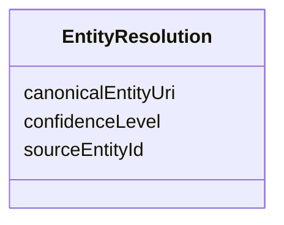

# Class: EntityResolution 


_An entity resolution response sent by the ERE._

__

_This contains a reference to the canonical entity URI, not the canonical entity description, _

_which is yielded through a separate channel/API endpoint._

__


URI: [ers:EntityResolution](https://data.europa.eu/ers/schema/EntityResolution)





<!-- no inheritance hierarchy -->


## Slots

| Name | Cardinality and Range | Description | Inheritance |
| ---  | --- | --- | --- |
| [canonicalEntityUri](canonicalEntityUri.md) | 0..1 <br/> [Uri](Uri.md) |  | direct |
| [sourceEntityId](sourceEntityId.md) | 0..1 <br/> [String](String.md) | The ID or URI of the source entity as provided in the `EntityResolutionReques... | direct |
| [confidenceLevel](confidenceLevel.md) | 0..1 <br/> [Float](Float.md) | A 0-1 value of how confident the ERE is about associating the original entity | direct |


## Examples

| Value |
| --- |
| {
  "canonicalEntityUri": "http://data.europa.eu/ers/id/entity_canonical_URI_id1",
  "sourceEntityId": "http://data.europa.eu/ers/id/324fs3r345vx-q11rea",
  "confidenceLevel": 0.91
}
 |

## Identifier and Mapping Information


### Schema Source


* from schema: https://data.europa.eu/ers/schema


## Mappings

| Mapping Type | Mapped Value |
| ---  | ---  |
| self | ers:EntityResolution |
| native | ers:EntityResolution |


## LinkML Source

<!-- TODO: investigate https://stackoverflow.com/questions/37606292/how-to-create-tabbed-code-blocks-in-mkdocs-or-sphinx -->

### Direct

<details>
```yaml
name: EntityResolution
description: "An entity resolution response sent by the ERE.\n\nThis contains a reference\
  \ to the canonical entity URI, not the canonical entity description, \nwhich is\
  \ yielded through a separate channel/API endpoint.\n"
examples:
- value: "{\n  \"canonicalEntityUri\": \"http://data.europa.eu/ers/id/entity_canonical_URI_id1\"\
    ,\n  \"sourceEntityId\": \"http://data.europa.eu/ers/id/324fs3r345vx-q11rea\"\
    ,\n  \"confidenceLevel\": 0.91\n}\n"
from_schema: https://data.europa.eu/ers/schema
attributes:
  canonicalEntityUri:
    name: canonicalEntityUri
    from_schema: https://data.europa.eu/ers/schema
    rank: 1000
    domain_of:
    - EntityResolution
    range: uri
  sourceEntityId:
    name: sourceEntityId
    description: 'The ID or URI of the source entity as provided in the `EntityResolutionRequest`.

      '
    from_schema: https://data.europa.eu/ers/schema
    rank: 1000
    domain_of:
    - EntityResolution
  confidenceLevel:
    name: confidenceLevel
    description: 'A 0-1 value of how confident the ERE is about associating the original
      entity

      with the canonical entity''s cluster.

      '
    from_schema: https://data.europa.eu/ers/schema
    rank: 1000
    domain_of:
    - EntityResolution
    range: float

```
</details>

### Induced

<details>
```yaml
name: EntityResolution
description: "An entity resolution response sent by the ERE.\n\nThis contains a reference\
  \ to the canonical entity URI, not the canonical entity description, \nwhich is\
  \ yielded through a separate channel/API endpoint.\n"
examples:
- value: "{\n  \"canonicalEntityUri\": \"http://data.europa.eu/ers/id/entity_canonical_URI_id1\"\
    ,\n  \"sourceEntityId\": \"http://data.europa.eu/ers/id/324fs3r345vx-q11rea\"\
    ,\n  \"confidenceLevel\": 0.91\n}\n"
from_schema: https://data.europa.eu/ers/schema
attributes:
  canonicalEntityUri:
    name: canonicalEntityUri
    from_schema: https://data.europa.eu/ers/schema
    rank: 1000
    alias: canonicalEntityUri
    owner: EntityResolution
    domain_of:
    - EntityResolution
    range: uri
  sourceEntityId:
    name: sourceEntityId
    description: 'The ID or URI of the source entity as provided in the `EntityResolutionRequest`.

      '
    from_schema: https://data.europa.eu/ers/schema
    rank: 1000
    alias: sourceEntityId
    owner: EntityResolution
    domain_of:
    - EntityResolution
    range: string
  confidenceLevel:
    name: confidenceLevel
    description: 'A 0-1 value of how confident the ERE is about associating the original
      entity

      with the canonical entity''s cluster.

      '
    from_schema: https://data.europa.eu/ers/schema
    rank: 1000
    alias: confidenceLevel
    owner: EntityResolution
    domain_of:
    - EntityResolution
    range: float

```
</details>