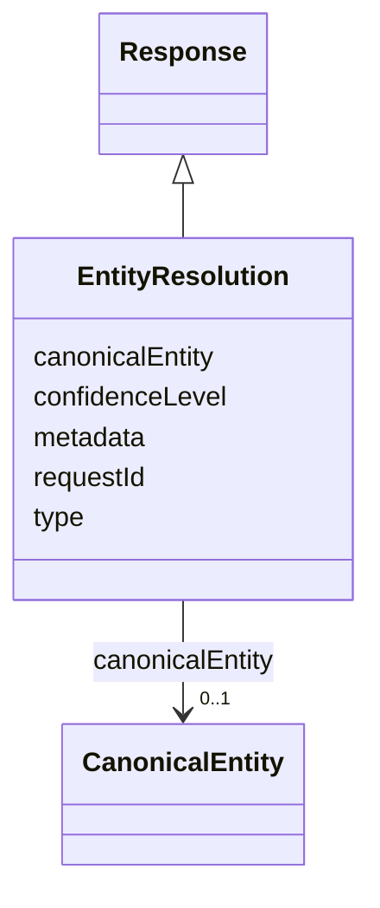

# Class: EntityResolution 


_An entity resolution response sent by the ERE._

__

_This contains a reference to the canonical entity that the ERE has associated to the original _

_entity in the request. It also reports a confidence score for the established association._

__


URI: [ers:EntityResolution](https://data.europa.eu/ers/schema/EntityResolution)





## Inheritance
* [Response](Response.md) [ [RequestOrResponseMixin](RequestOrResponseMixin.md)]
    * **EntityResolution**


## Slots

| Name | Cardinality and Range | Description | Inheritance |
| ---  | --- | --- | --- |
| [canonicalEntity](canonicalEntity.md) | 0..1 <br/> [CanonicalEntity](CanonicalEntity.md) | The canonical entity that the ERE has associated to the original entity | direct |
| [confidenceLevel](confidenceLevel.md) | 0..1 <br/> [Float](Float.md) | A 0-1 value of how confident the ERE is about associating the original entity | direct |
| [requestId](requestId.md) | 0..1 <br/> [String](String.md) | A string representing the unique ID of the request this response is about | [Response](Response.md) |
| [type](type.md) | 0..1 <br/> [String](String.md) | The type of the request or result | [RequestOrResponseMixin](RequestOrResponseMixin.md) |
| [metadata](metadata.md) | 0..1 <br/> [String](String.md) | An optional arbitrary dictionary of further request metadata | [RequestOrResponseMixin](RequestOrResponseMixin.md) |


## Examples

| Value |
| --- |
| {
  "type": "EntityResolution",
  "sourceEntityId": "http://data.europa.eu/ers/id/324fs3r345vx-q11rea",
  "confidenceLevel": 0.91,
  "requestId": "324fs3r345vx"
  "canonicalEntity": 
  { 
    "type": "http://www.w3.org/ns/org#Organization",
    "id": "http://data.europa.eu/ers/id/324fs3r345vx-aa32wa",
    "entityData": "epd:ent001 a org:Organization; ...   cccev:telephone \"+441924306780\" .",
    "entityDataFormat": "text/turtle"
  }
}
 |

## Identifier and Mapping Information


### Schema Source


* from schema: https://data.europa.eu/ers/schema


## Mappings

| Mapping Type | Mapped Value |
| ---  | ---  |
| self | ers:EntityResolution |
| native | ers:EntityResolution |


## LinkML Source

<!-- TODO: investigate https://stackoverflow.com/questions/37606292/how-to-create-tabbed-code-blocks-in-mkdocs-or-sphinx -->

### Direct

<details>
```yaml
name: EntityResolution
description: "An entity resolution response sent by the ERE.\n\nThis contains a reference\
  \ to the canonical entity that the ERE has associated to the original \nentity in\
  \ the request. It also reports a confidence score for the established association.\n"
examples:
- value: "{\n  \"type\": \"EntityResolution\",\n  \"sourceEntityId\": \"http://data.europa.eu/ers/id/324fs3r345vx-q11rea\"\
    ,\n  \"confidenceLevel\": 0.91,\n  \"requestId\": \"324fs3r345vx\"\n  \"canonicalEntity\"\
    : \n  { \n    \"type\": \"http://www.w3.org/ns/org#Organization\",\n    \"id\"\
    : \"http://data.europa.eu/ers/id/324fs3r345vx-aa32wa\",\n    \"entityData\": \"\
    epd:ent001 a org:Organization; ...   cccev:telephone \\\"+441924306780\\\" .\"\
    ,\n    \"entityDataFormat\": \"text/turtle\"\n  }\n}\n"
from_schema: https://data.europa.eu/ers/schema
is_a: Response
attributes:
  canonicalEntity:
    name: canonicalEntity
    description: 'The canonical entity that the ERE has associated to the original
      entity.

      TODO: the canonical entity URI is available from the this attribute, should
      we

      have it at the parent level too?

      '
    from_schema: https://data.europa.eu/ers/schema
    rank: 1000
    domain_of:
    - EntityResolution
    range: CanonicalEntity
  confidenceLevel:
    name: confidenceLevel
    description: 'A 0-1 value of how confident the ERE is about associating the original
      entity

      with the canonical entity''s cluster.

      '
    from_schema: https://data.europa.eu/ers/schema
    rank: 1000
    domain_of:
    - EntityResolution
    range: float

```
</details>

### Induced

<details>
```yaml
name: EntityResolution
description: "An entity resolution response sent by the ERE.\n\nThis contains a reference\
  \ to the canonical entity that the ERE has associated to the original \nentity in\
  \ the request. It also reports a confidence score for the established association.\n"
examples:
- value: "{\n  \"type\": \"EntityResolution\",\n  \"sourceEntityId\": \"http://data.europa.eu/ers/id/324fs3r345vx-q11rea\"\
    ,\n  \"confidenceLevel\": 0.91,\n  \"requestId\": \"324fs3r345vx\"\n  \"canonicalEntity\"\
    : \n  { \n    \"type\": \"http://www.w3.org/ns/org#Organization\",\n    \"id\"\
    : \"http://data.europa.eu/ers/id/324fs3r345vx-aa32wa\",\n    \"entityData\": \"\
    epd:ent001 a org:Organization; ...   cccev:telephone \\\"+441924306780\\\" .\"\
    ,\n    \"entityDataFormat\": \"text/turtle\"\n  }\n}\n"
from_schema: https://data.europa.eu/ers/schema
is_a: Response
attributes:
  canonicalEntity:
    name: canonicalEntity
    description: 'The canonical entity that the ERE has associated to the original
      entity.

      TODO: the canonical entity URI is available from the this attribute, should
      we

      have it at the parent level too?

      '
    from_schema: https://data.europa.eu/ers/schema
    rank: 1000
    alias: canonicalEntity
    owner: EntityResolution
    domain_of:
    - EntityResolution
    range: CanonicalEntity
  confidenceLevel:
    name: confidenceLevel
    description: 'A 0-1 value of how confident the ERE is about associating the original
      entity

      with the canonical entity''s cluster.

      '
    from_schema: https://data.europa.eu/ers/schema
    rank: 1000
    alias: confidenceLevel
    owner: EntityResolution
    domain_of:
    - EntityResolution
    range: float
  requestId:
    name: requestId
    description: 'A string representing the unique ID of the request this response
      is about.

      '
    from_schema: https://data.europa.eu/ers/schema
    alias: requestId
    owner: EntityResolution
    domain_of:
    - Request
    - Response
    range: string
  type:
    name: type
    description: "The type of the request or result.\n\nAs per LinkML specification,\
      \ `designates_type` is used here in order to allow for this\nslot to tell the\
      \ concrete subclass that an instance (such as a JSON object) belongs to.\n\n\
      In other words, a particular request will have `type` set with values like \n\
      `EntityResolutionRequest` or `EntityResolutionResult`\n"
    from_schema: https://data.europa.eu/ers/schema
    rank: 1000
    designates_type: true
    alias: type
    owner: EntityResolution
    domain_of:
    - RequestOrResponseMixin
    - Entity
    range: string
  metadata:
    name: metadata
    description: 'An optional arbitrary dictionary of further request metadata.

      '
    from_schema: https://data.europa.eu/ers/schema
    rank: 1000
    alias: metadata
    owner: EntityResolution
    domain_of:
    - RequestOrResponseMixin
    range: string

```
</details>