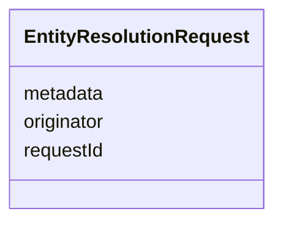

# Class: EntityResolutionRequest 


_An entity resolution request sent by to the ERE, containing the entity to be resolved._

__


URI: [ers:EntityResolutionRequest](https://data.europa.eu/ers/schema/EntityResolutionRequest)





<!-- no inheritance hierarchy -->


## Slots

| Name | Cardinality and Range | Description | Inheritance |
| ---  | --- | --- | --- |
| [requestId](requestId.md) | 0..1 <br/> [String](String.md) | A string representing the unique ID of this request | direct |
| [originator](originator.md) | 0..1 <br/> [String](String.md) | The ID or URI of the request originator | direct |
| [metadata](metadata.md) | 0..1 <br/> [String](String.md) | An arbitrary dictionary of further request metadata | direct |


## Examples

| Value |
| --- |
| {
  "entity": "epd:ent005 a org:Organization; ...   cccev:telephone \"+44 1924306780\" .",
  "entityType": "http://www.w3.org/ns/org#Organization",
  "entityDataFormat": "text/turtle",
  "entityId": "http://data.europa.eu/ers/id/324fs3r345vx-aa32wa",
  "originator": "TED SWS pipeline",
  "requestId": "324fs3r345vx",
  "metadata": {
    "originator system": "VocBench editor",
    "originator timestamp": "23748737643"
  }
}
 |

## Identifier and Mapping Information


### Schema Source


* from schema: https://data.europa.eu/ers/schema


## Mappings

| Mapping Type | Mapped Value |
| ---  | ---  |
| self | ers:EntityResolutionRequest |
| native | ers:EntityResolutionRequest |


## LinkML Source

<!-- TODO: investigate https://stackoverflow.com/questions/37606292/how-to-create-tabbed-code-blocks-in-mkdocs-or-sphinx -->

### Direct

<details>
```yaml
name: EntityResolutionRequest
description: 'An entity resolution request sent by to the ERE, containing the entity
  to be resolved.

  '
examples:
- value: "{\n  \"entity\": \"epd:ent005 a org:Organization; ...   cccev:telephone\
    \ \\\"+44 1924306780\\\" .\",\n  \"entityType\": \"http://www.w3.org/ns/org#Organization\"\
    ,\n  \"entityDataFormat\": \"text/turtle\",\n  \"entityId\": \"http://data.europa.eu/ers/id/324fs3r345vx-aa32wa\"\
    ,\n  \"originator\": \"TED SWS pipeline\",\n  \"requestId\": \"324fs3r345vx\"\
    ,\n  \"metadata\": {\n    \"originator system\": \"VocBench editor\",\n    \"\
    originator timestamp\": \"23748737643\"\n  }\n}\n"
from_schema: https://data.europa.eu/ers/schema
attributes:
  requestId:
    name: requestId
    description: 'A string representing the unique ID of this request.

      '
    from_schema: https://data.europa.eu/ers/schema
    rank: 1000
    domain_of:
    - EntityResolutionRequest
  originator:
    name: originator
    description: 'The ID or URI of the request originator.

      '
    from_schema: https://data.europa.eu/ers/schema
    rank: 1000
    domain_of:
    - EntityResolutionRequest
  metadata:
    name: metadata
    description: 'An arbitrary dictionary of further request metadata.

      '
    from_schema: https://data.europa.eu/ers/schema
    rank: 1000
    domain_of:
    - EntityResolutionRequest

```
</details>

### Induced

<details>
```yaml
name: EntityResolutionRequest
description: 'An entity resolution request sent by to the ERE, containing the entity
  to be resolved.

  '
examples:
- value: "{\n  \"entity\": \"epd:ent005 a org:Organization; ...   cccev:telephone\
    \ \\\"+44 1924306780\\\" .\",\n  \"entityType\": \"http://www.w3.org/ns/org#Organization\"\
    ,\n  \"entityDataFormat\": \"text/turtle\",\n  \"entityId\": \"http://data.europa.eu/ers/id/324fs3r345vx-aa32wa\"\
    ,\n  \"originator\": \"TED SWS pipeline\",\n  \"requestId\": \"324fs3r345vx\"\
    ,\n  \"metadata\": {\n    \"originator system\": \"VocBench editor\",\n    \"\
    originator timestamp\": \"23748737643\"\n  }\n}\n"
from_schema: https://data.europa.eu/ers/schema
attributes:
  requestId:
    name: requestId
    description: 'A string representing the unique ID of this request.

      '
    from_schema: https://data.europa.eu/ers/schema
    rank: 1000
    alias: requestId
    owner: EntityResolutionRequest
    domain_of:
    - EntityResolutionRequest
    range: string
  originator:
    name: originator
    description: 'The ID or URI of the request originator.

      '
    from_schema: https://data.europa.eu/ers/schema
    rank: 1000
    alias: originator
    owner: EntityResolutionRequest
    domain_of:
    - EntityResolutionRequest
    range: string
  metadata:
    name: metadata
    description: 'An arbitrary dictionary of further request metadata.

      '
    from_schema: https://data.europa.eu/ers/schema
    rank: 1000
    alias: metadata
    owner: EntityResolutionRequest
    domain_of:
    - EntityResolutionRequest
    range: string

```
</details>