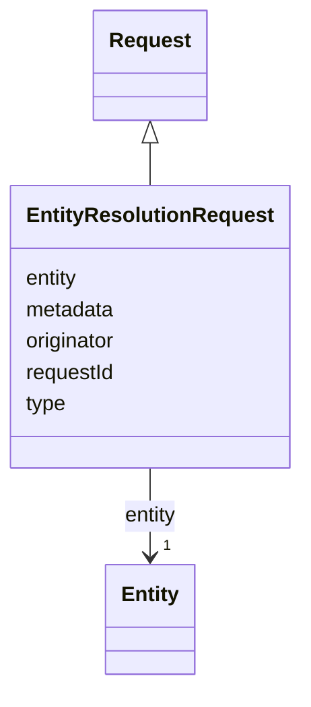

# Class: EntityResolutionRequest 


_An entity resolution request sent to the ERE, containing the entity to be resolved._

__


URI: [ers:EntityResolutionRequest](https://data.europa.eu/ers/schema/EntityResolutionRequest)





## Inheritance
* [Request](Request.md) [ [RequestOrResponseMixin](RequestOrResponseMixin.md)]
    * **EntityResolutionRequest**


## Slots

| Name | Cardinality and Range | Description | Inheritance |
| ---  | --- | --- | --- |
| [entity](entity.md) | 1 <br/> [Entity](Entity.md) | The data about the entity to be resolved | direct |
| [requestId](requestId.md) | 1 <br/> [String](String.md) | A string representing the unique ID of this request | [Request](Request.md) |
| [originator](originator.md) | 1 <br/> [String](String.md) | The ID or URI of the request originator | [Request](Request.md) |
| [type](type.md) | 1 <br/> [String](String.md) | The type of the request or result | [RequestOrResponseMixin](RequestOrResponseMixin.md) |
| [metadata](metadata.md) | 0..1 <br/> [String](String.md) | An optional arbitrary dictionary of further request metadata | [RequestOrResponseMixin](RequestOrResponseMixin.md) |


## Examples

| Value |
| --- |
| {
  "type": "EntityResolutionRequest",            
  "entity": 
  { 
    "type": "http://www.w3.org/ns/org#Organization",
    "id": "http://data.europa.eu/ers/id/324fs3r345vx-aa32wa",
    "entityData": "epd:ent005 a org:Organization; ...   cccev:telephone \"+44 1924306780\" .",
    "entityDataFormat": "text/turtle"
  },
  "requestId": "324fs3r345vx",
  "originator": "TED SWS pipeline",
  "metadata": {
    "originator system": "VocBench editor",
    "originator timestamp": "23748737643"
  }
}
 |

## Identifier and Mapping Information


### Schema Source


* from schema: https://data.europa.eu/ers/schema


## Mappings

| Mapping Type | Mapped Value |
| ---  | ---  |
| self | ers:EntityResolutionRequest |
| native | ers:EntityResolutionRequest |


## LinkML Source

<!-- TODO: investigate https://stackoverflow.com/questions/37606292/how-to-create-tabbed-code-blocks-in-mkdocs-or-sphinx -->

### Direct

<details>
```yaml
name: EntityResolutionRequest
description: 'An entity resolution request sent to the ERE, containing the entity
  to be resolved.

  '
examples:
- value: "{\n  \"type\": \"EntityResolutionRequest\",            \n  \"entity\": \n\
    \  { \n    \"type\": \"http://www.w3.org/ns/org#Organization\",\n    \"id\": \"\
    http://data.europa.eu/ers/id/324fs3r345vx-aa32wa\",\n    \"entityData\": \"epd:ent005\
    \ a org:Organization; ...   cccev:telephone \\\"+44 1924306780\\\" .\",\n    \"\
    entityDataFormat\": \"text/turtle\"\n  },\n  \"requestId\": \"324fs3r345vx\",\n\
    \  \"originator\": \"TED SWS pipeline\",\n  \"metadata\": {\n    \"originator\
    \ system\": \"VocBench editor\",\n    \"originator timestamp\": \"23748737643\"\
    \n  }\n}\n"
from_schema: https://data.europa.eu/ers/schema
is_a: Request
attributes:
  entity:
    name: entity
    description: 'The data about the entity to be resolved.

      '
    from_schema: https://data.europa.eu/ers/schema
    rank: 1000
    domain_of:
    - EntityResolutionRequest
    range: Entity
    required: true

```
</details>

### Induced

<details>
```yaml
name: EntityResolutionRequest
description: 'An entity resolution request sent to the ERE, containing the entity
  to be resolved.

  '
examples:
- value: "{\n  \"type\": \"EntityResolutionRequest\",            \n  \"entity\": \n\
    \  { \n    \"type\": \"http://www.w3.org/ns/org#Organization\",\n    \"id\": \"\
    http://data.europa.eu/ers/id/324fs3r345vx-aa32wa\",\n    \"entityData\": \"epd:ent005\
    \ a org:Organization; ...   cccev:telephone \\\"+44 1924306780\\\" .\",\n    \"\
    entityDataFormat\": \"text/turtle\"\n  },\n  \"requestId\": \"324fs3r345vx\",\n\
    \  \"originator\": \"TED SWS pipeline\",\n  \"metadata\": {\n    \"originator\
    \ system\": \"VocBench editor\",\n    \"originator timestamp\": \"23748737643\"\
    \n  }\n}\n"
from_schema: https://data.europa.eu/ers/schema
is_a: Request
attributes:
  entity:
    name: entity
    description: 'The data about the entity to be resolved.

      '
    from_schema: https://data.europa.eu/ers/schema
    rank: 1000
    alias: entity
    owner: EntityResolutionRequest
    domain_of:
    - EntityResolutionRequest
    range: Entity
    required: true
  requestId:
    name: requestId
    description: 'A string representing the unique ID of this request.

      '
    from_schema: https://data.europa.eu/ers/schema
    rank: 1000
    alias: requestId
    owner: EntityResolutionRequest
    domain_of:
    - Request
    - Response
    range: string
    required: true
  originator:
    name: originator
    description: 'The ID or URI of the request originator.

      '
    from_schema: https://data.europa.eu/ers/schema
    rank: 1000
    alias: originator
    owner: EntityResolutionRequest
    domain_of:
    - Request
    range: string
    required: true
  type:
    name: type
    description: "The type of the request or result.\n\nAs per LinkML specification,\
      \ `designates_type` is used here in order to allow for this\nslot to tell the\
      \ concrete subclass that an instance (such as a JSON object) belongs to.\n\n\
      In other words, a particular request will have `type` set with values like \n\
      `EntityResolutionRequest` or `EntityResolutionResult`\n"
    from_schema: https://data.europa.eu/ers/schema
    rank: 1000
    designates_type: true
    alias: type
    owner: EntityResolutionRequest
    domain_of:
    - RequestOrResponseMixin
    - Entity
    range: string
    required: true
  metadata:
    name: metadata
    description: 'An optional arbitrary dictionary of further request metadata.

      '
    from_schema: https://data.europa.eu/ers/schema
    rank: 1000
    alias: metadata
    owner: EntityResolutionRequest
    domain_of:
    - RequestOrResponseMixin
    range: string

```
</details>