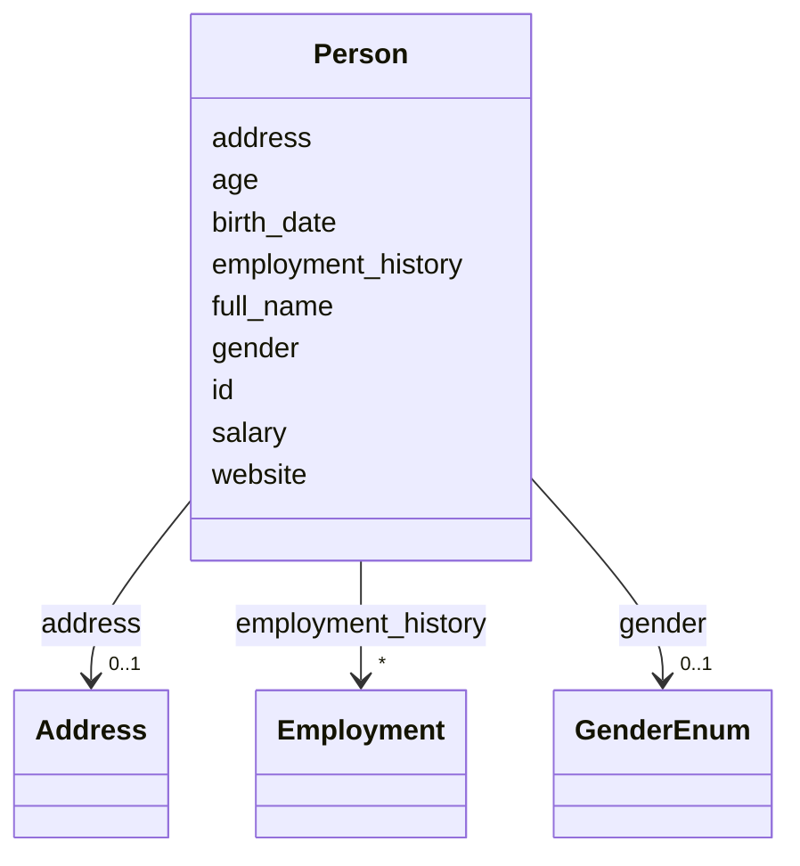

# Class: Person 


URI: [schema:Person](http://schema.org/Person)





<!-- no inheritance hierarchy -->


## Slots

| Name | Cardinality and Range | Description | Inheritance |
| ---  | --- | --- | --- |
| [address](address.md) | 0..1 <br/> [Address](Address.md) |  | direct |
| [employment_history](employment_history.md) | * <br/> [Employment](Employment.md) |  | direct |
| [id](id.md) | 1 <br/> [String](String.md) |  | direct |
| [full_name](full_name.md) | 1 <br/> [String](String.md) |  | direct |
| [age](age.md) | 0..1 <br/> [Integer](Integer.md) |  | direct |
| [gender](gender.md) | 0..1 <br/> [GenderEnum](GenderEnum.md) |  | direct |
| [birth_date](birth_date.md) | 1 <br/> [Date](Date.md) |  | direct |
| [website](website.md) | 0..1 <br/> [Uri](Uri.md) |  | direct |
| [salary](salary.md) | 0..1 <br/> [Decimal](Decimal.md) |  | direct |


## Usages

| used by | used in | type | used |
| ---  | --- | --- | --- |
| [Person](Person.md) | [address](address.md) | domain | [Person](Person.md) |
| [Person](Person.md) | [employment_history](employment_history.md) | domain | [Person](Person.md) |
| [Employment](Employment.md) | [address](address.md) | domain | [Person](Person.md) |


## Identifier and Mapping Information


### Schema Source


* from schema: https://w3id.org/linkml/examples/personinfo


## Mappings

| Mapping Type | Mapped Value |
| ---  | ---  |
| self | schema:Person |
| native | https://w3id.org/linkml/examples/personinfo/Person |


## LinkML Source

<!-- TODO: investigate https://stackoverflow.com/questions/37606292/how-to-create-tabbed-code-blocks-in-mkdocs-or-sphinx -->

### Direct

<details>
```yaml
name: Person
from_schema: https://w3id.org/linkml/examples/personinfo
slots:
- address
- employment_history
attributes:
  id:
    name: id
    from_schema: https://w3id.org/linkml/examples/personinfo
    rank: 1000
    identifier: true
    domain_of:
    - Person
    required: true
  full_name:
    name: full_name
    from_schema: https://w3id.org/linkml/examples/personinfo
    rank: 1000
    domain_of:
    - Person
    range: string
    required: true
  age:
    name: age
    from_schema: https://w3id.org/linkml/examples/personinfo
    rank: 1000
    domain_of:
    - Person
    range: integer
    minimum_value: 0
    maximum_value: 200
  gender:
    name: gender
    from_schema: https://w3id.org/linkml/examples/personinfo
    rank: 1000
    domain_of:
    - Person
    range: GenderEnum
  birth_date:
    name: birth_date
    from_schema: https://w3id.org/linkml/examples/personinfo
    rank: 1000
    domain_of:
    - Person
    range: date
    required: true
  website:
    name: website
    from_schema: https://w3id.org/linkml/examples/personinfo
    rank: 1000
    domain_of:
    - Person
    range: uri
  salary:
    name: salary
    from_schema: https://w3id.org/linkml/examples/personinfo
    rank: 1000
    domain_of:
    - Person
    range: decimal
class_uri: schema:Person

```
</details>

### Induced

<details>
```yaml
name: Person
from_schema: https://w3id.org/linkml/examples/personinfo
attributes:
  id:
    name: id
    from_schema: https://w3id.org/linkml/examples/personinfo
    rank: 1000
    identifier: true
    alias: id
    owner: Person
    domain_of:
    - Person
  full_name:
    name: full_name
    from_schema: https://w3id.org/linkml/examples/personinfo
    rank: 1000
    alias: full_name
    owner: Person
    domain_of:
    - Person
    range: string
    required: true
  age:
    name: age
    from_schema: https://w3id.org/linkml/examples/personinfo
    rank: 1000
    alias: age
    owner: Person
    domain_of:
    - Person
    range: integer
    minimum_value: 0
    maximum_value: 200
  gender:
    name: gender
    from_schema: https://w3id.org/linkml/examples/personinfo
    rank: 1000
    alias: gender
    owner: Person
    domain_of:
    - Person
    range: GenderEnum
  birth_date:
    name: birth_date
    from_schema: https://w3id.org/linkml/examples/personinfo
    rank: 1000
    alias: birth_date
    owner: Person
    domain_of:
    - Person
    range: date
    required: true
  website:
    name: website
    from_schema: https://w3id.org/linkml/examples/personinfo
    rank: 1000
    alias: website
    owner: Person
    domain_of:
    - Person
    range: uri
  salary:
    name: salary
    from_schema: https://w3id.org/linkml/examples/personinfo
    rank: 1000
    alias: salary
    owner: Person
    domain_of:
    - Person
    range: decimal
  address:
    name: address
    from_schema: https://w3id.org/linkml/examples/personinfo
    rank: 1000
    domain: Person
    alias: address
    owner: Person
    domain_of:
    - Person
    - Employment
    range: Address
  employment_history:
    name: employment_history
    from_schema: https://w3id.org/linkml/examples/personinfo
    rank: 1000
    domain: Person
    alias: employment_history
    owner: Person
    domain_of:
    - Person
    range: Employment
    multivalued: true
class_uri: schema:Person

```
</details>