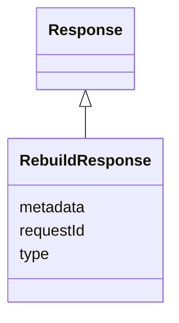

# Class: RebuildResponse 


_A response to a `RebuildRequest`, confirming that the rebuild process has started._

__

_This should carry the `requestId` attribute._

__


URI: [ers:RebuildResponse](https://data.europa.eu/ers/schema/RebuildResponse)





## Inheritance
* [Response](Response.md) [ [RequestOrResponseMixin](RequestOrResponseMixin.md)]
    * **RebuildResponse**


## Slots

| Name | Cardinality and Range | Description | Inheritance |
| ---  | --- | --- | --- |
| [requestId](requestId.md) | 1 <br/> [String](String.md) | A string representing the unique ID of the request this response is about | [Response](Response.md) |
| [type](type.md) | 1 <br/> [String](String.md) | The type of the request or result | [RequestOrResponseMixin](RequestOrResponseMixin.md) |
| [metadata](metadata.md) | 0..1 <br/> [String](String.md) | An optional arbitrary dictionary of further request metadata | [RequestOrResponseMixin](RequestOrResponseMixin.md) |


## Identifier and Mapping Information


### Schema Source


* from schema: https://data.europa.eu/ers/schema


## Mappings

| Mapping Type | Mapped Value |
| ---  | ---  |
| self | ers:RebuildResponse |
| native | ers:RebuildResponse |


## LinkML Source

<!-- TODO: investigate https://stackoverflow.com/questions/37606292/how-to-create-tabbed-code-blocks-in-mkdocs-or-sphinx -->

### Direct

<details>
```yaml
name: RebuildResponse
description: 'A response to a `RebuildRequest`, confirming that the rebuild process
  has started.


  This should carry the `requestId` attribute.

  '
from_schema: https://data.europa.eu/ers/schema
is_a: Response

```
</details>

### Induced

<details>
```yaml
name: RebuildResponse
description: 'A response to a `RebuildRequest`, confirming that the rebuild process
  has started.


  This should carry the `requestId` attribute.

  '
from_schema: https://data.europa.eu/ers/schema
is_a: Response
attributes:
  requestId:
    name: requestId
    description: 'A string representing the unique ID of the request this response
      is about.

      '
    from_schema: https://data.europa.eu/ers/schema
    alias: requestId
    owner: RebuildResponse
    domain_of:
    - Request
    - Response
    range: string
    required: true
  type:
    name: type
    description: "The type of the request or result.\n\nAs per LinkML specification,\
      \ `designates_type` is used here in order to allow for this\nslot to tell the\
      \ concrete subclass that an instance (such as a JSON object) belongs to.\n\n\
      In other words, a particular request will have `type` set with values like \n\
      `EntityResolutionRequest` or `EntityResolutionResult`\n"
    from_schema: https://data.europa.eu/ers/schema
    rank: 1000
    designates_type: true
    alias: type
    owner: RebuildResponse
    domain_of:
    - RequestOrResponseMixin
    - Entity
    range: string
    required: true
  metadata:
    name: metadata
    description: 'An optional arbitrary dictionary of further request metadata.

      '
    from_schema: https://data.europa.eu/ers/schema
    rank: 1000
    alias: metadata
    owner: RebuildResponse
    domain_of:
    - RequestOrResponseMixin
    range: string

```
</details>